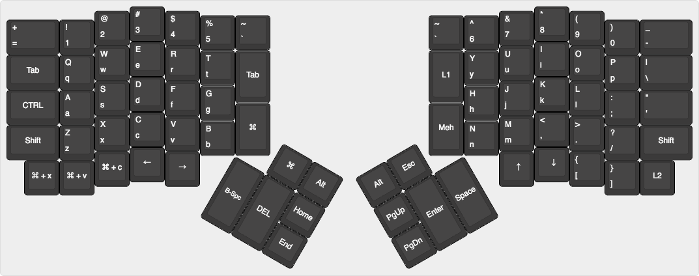
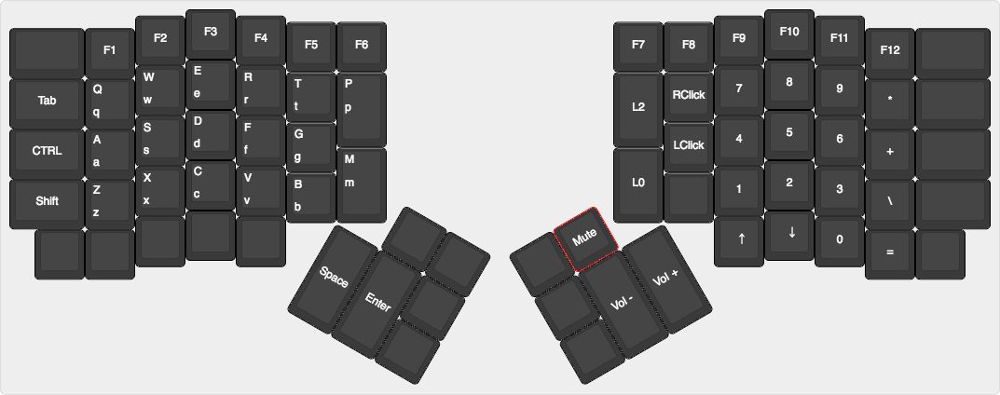
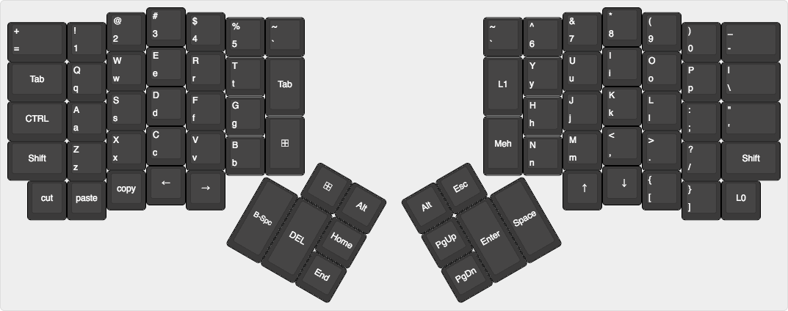

# ErgoDox EZ Default Configuration
## Layout

### [Layer 0](http://goo.gl/qteHWJ)

http://www.keyboard-layout-editor.com/##@@_x:3.5&c=%233b3a3a&t=%23cccccc%3B&=%23%0A3&_x:10.5%3B&=*%0A8%3B&@_y:-0.875&x:2.5%3B&=%2F@%0A2&_x:1%3B&=$%0A4&_x:8.5%3B&=%2F&%0A7&_x:1%3B&=(%0A9%3B&@_y:-0.875&x:5.5%3B&=%25%0A5&=%5E%0A6&_x:4.5%3B&=~%0A%60&=%5E%0A6%3B&@_y:-0.875&w:1.5%3B&=~%0A%60&=!%0A1&_x:14.5%3B&=)%0A0&_w:1.5%3B&=%2F_%0A-%3B&@_y:-0.375&x:3.5%3B&=E%0Ae&_x:10.5%3B&=I%0Ai%3B&@_y:-0.875&x:2.5%3B&=W%0Aw&_x:1%3B&=R%0Ar&_x:8.5%3B&=U%0Au&_x:1%3B&=O%0Ao%3B&@_y:-0.875&x:5.5%3B&=T%0At&_a:7&h:1.5%3B&=L0&_x:4.5&h:1.5%3B&=L1&_a:4%3B&=Y%0Ay%3B&@_y:-0.875&a:7&w:1.5%3B&=Tab&_a:4%3B&=Q%0Aq&_x:14.5%3B&=P%0Ap&_w:1.5%3B&=%7C%0A%5C%3B&@_y:-0.375&x:3.5%3B&=D%0Ad&_x:10.5%3B&=K%0Ak%3B&@_y:-0.875&x:2.5%3B&=S%0As&_x:1%3B&=F%0Af&_x:8.5%3B&=J%0Aj&_x:1%3B&=L%0Al%3B&@_y:-0.875&x:5.5%3B&=G%0Ag&_x:6.5%3B&=H%0Ah%3B&@_y:-0.875&a:7&w:1.5%3B&=CTRL&_a:4%3B&=A%0Aa&_x:14.5%3B&=%2F:%0A%2F%3B&_w:1.5%3B&=%22%0A'%3B&@_y:-0.625&x:6.5&a:7&h:1.5%3B&=L2&_x:4.5&h:1.5%3B&=B%3B&@_y:-0.75&x:3.5&a:4%3B&=C%0Ac&_x:10.5%3B&=%3C%0A,%3B&@_y:-0.875&x:2.5%3B&=X%0Ax&_x:1%3B&=V%0Av&_x:8.5%3B&=M%0Am&_x:1%3B&=%3E%0A.%3B&@_y:-0.875&x:5.5%3B&=B%0Ab&_x:6.5%3B&=N%0An%3B&@_y:-0.875&a:7&w:1.5%3B&=Shift&_a:4%3B&=Z%0Az&_x:14.5%3B&=%3F%0A%2F%2F&_a:7&w:1.5%3B&=Shift%3B&@_y:-0.375&x:3.5%3B&=%E2%8C%98&_x:10.5&a:4%3B&=%7B%0A%5B%3B&@_y:-0.875&x:2.5&a:7%3B&=option&_x:1%3B&=%E2%8C%98&_x:8.5%3B&=%E2%8C%98&_x:1&a:4%3B&=%7D%0A%5D%3B&@_y:-0.75&x:0.5&a:7%3B&=Esc&=options&_x:14.5&a:4%3B&=+%0A%2F=&_a:7%3B&=+L2%3B&@_r:30&rx:6.5&ry:4.25&y:-1&x:1%3B&=%E2%86%90&=%E2%86%92%3B&@_sm=cherry&sb=gateron&st=KS-3-Red&h:2%3B&=Space&_h:2%3B&=BS&=Home%3B&@_x:2%3B&=End%3B&@_r:-30&rx:13&y:-1&x:-3%3B&=%E2%86%93&=%E2%86%91%3B&@_x:-3%3B&=PgUp&_h:2%3B&=Enter&_h:2%3B&=Space%3B&@_x:-3%3B&=PgDn

### [Layer 1](http://goo.gl/tBx58O)

### [Layer 2](http://goo.gl/glWmrM)

## Changelog

* Apr 24, 2016:
  * ymotongpoo totally changed its default from original.

* Feb 2, 2016 (V1.1): 
  * Made the right-hand quote key double as Cmd/Win on hold. So you get ' when you tap it, " when you tap it with Shift, and Cmd or Win when you hold it. You can then use it as a modifier, or just press and hold it for a moment (and then let go) to send a single Cmd or Win keystroke (handy for opening the Start menu on Windows).

This is what we ship with out of the factory. :) The image says it all:

